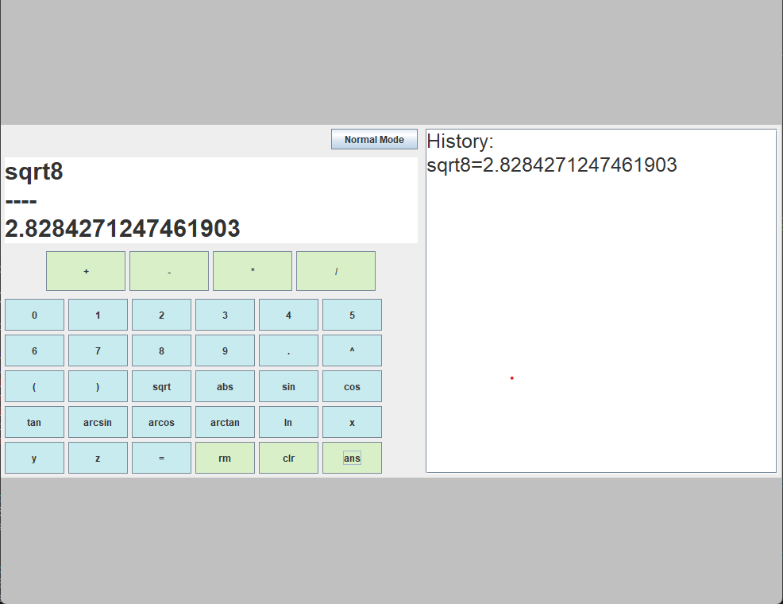
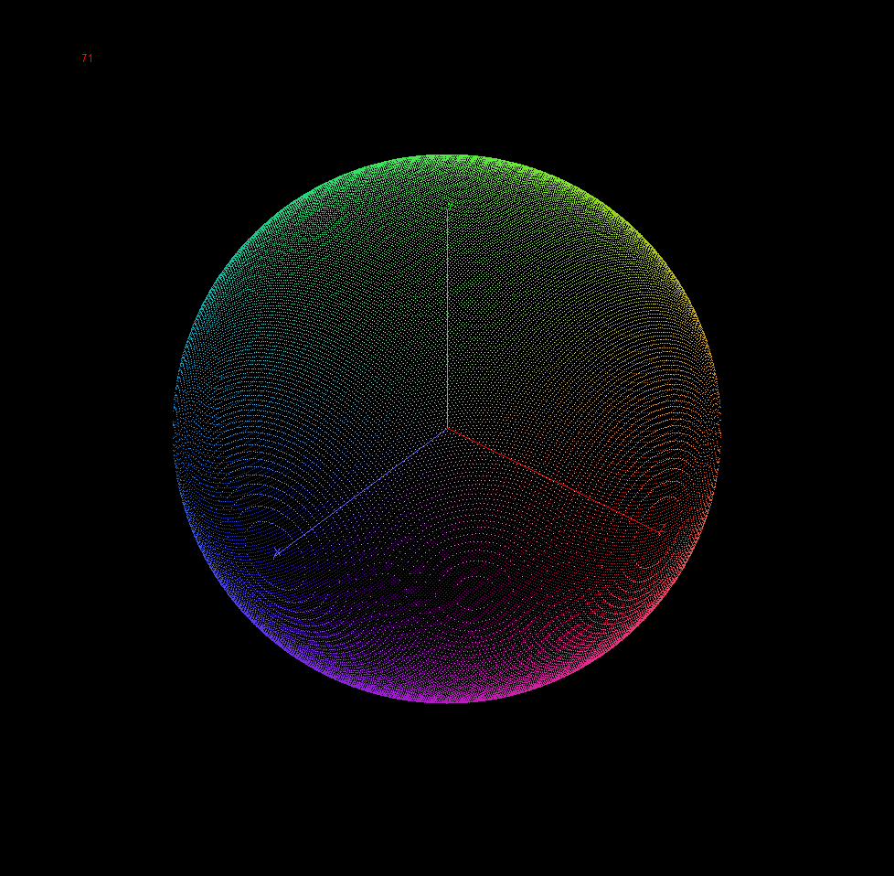

# CalcMaestro
## Sexy Ass Calculator
### Ankit Malhotra, Reshil Bejoy, Teja Koripella

##### Features
- Order of Operations
- Functions
- History
- 2D Graphing
- 3D Graphing
- 3D Graph Rotation
- Non-function and Implicit Equation Graphing

##### References
- [Projection](https://en.wikipedia.org/wiki/Projection)
- [Cool 3D Equations](https://www.benjoffe.com/code/tools/functions3d/examples)
- [JSwing Course](https://www.youtube.com/watch?v=Kmgo00avvEw)
- [GridBag Layout](https://www.youtube.com/watch?v=g2vDARb7gx8)
- [Rotation Matrices](https://en.wikipedia.org/wiki/Rotation_matrix)
- [Oracle Java Docs]
- [Java Graphics](https://www.youtube.com/watch?v=KcEvHq8Pqs0)
- Double Buffering
